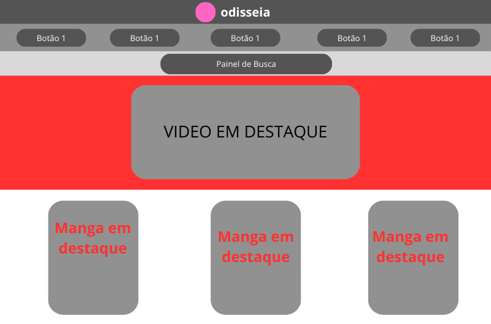
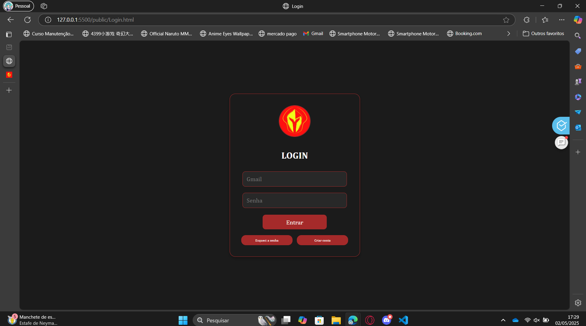

# Trabalho Prático - Semana 03

Dessa vez, vamos escolher uma proposta de projeto para trabalhar. Na [lista de propostas de projetos](propostas-projetos.md), escolha um dentre as alternativas.

Nessa atividade, você deverá montar a página inicial do projeto escolhido, a organização do HTML aplicando semântica correta e uso aprimorado do CSS. Leia o enunciado completo no Canvas para mais detalhes.

**IMPORTANTE:** Você deve trabalhar e alterar apenas arquivos dentro da pasta **`public`**. Deixe todos os demais arquivos e pastas desse repositório inalterados. **PRESTE MUITA ATENÇÃO NISSO.**

## Informações Gerais

- Nome:Victor Hugo Ribeiro
- Matricula: 881567
- Proposta de projeto escolhida:  Biblioteca de mangas

- Breve descrição sobre seu projeto:
uma plataforma de mangas e historia em quadrinhos,  deve haver uma galeria de mangas em destaque na tela inicial e uma espaço apra galeria de diferentes tipos de mangas

## Print do esboço criada

## Print da home-page criada

